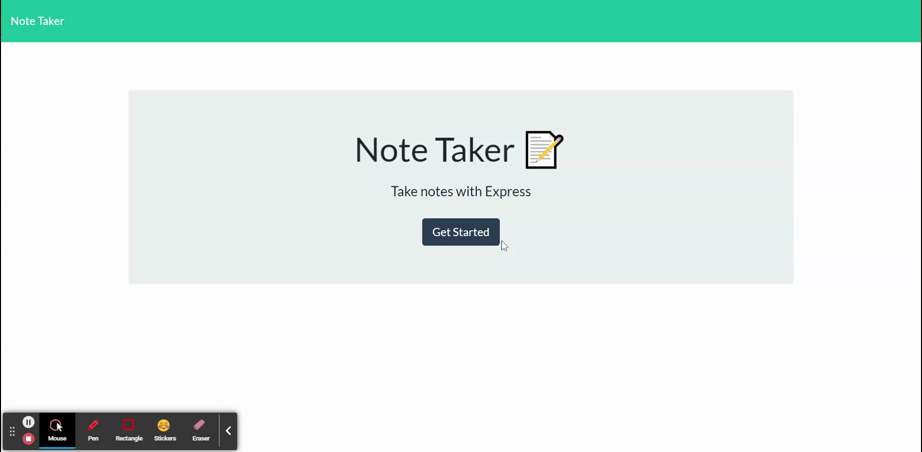

# 11 Express.js: Note Taker

[](https://opensource.org/licenses/MIT)

## Description 

Refactored starter-code to create an application called Note Taker that can be used to write and save notes using an Express.js back-end. Notes are saved and retrieved from a JSON file. Front-end code was included in starter code.  

### Motivation
This project our first foray into truly full-stack web design as part of our Full Stack Bootcamp through the University of Washington. 

### Learning Targets
This exercise provided my first experience with building an Express.js server, writing all back end code and connecting it to the front end, and deploying an application in Heroku.

## Table of Contents
- [Core Objectives Met](#Core)
- [Technologies Used](#Technologies)
- [Local Installation & Usage](#Local)
- [Deployed App](#Deployed)
- [Demo](#Demo)
- [License](#MIT)
- [Questions](#Questions)

## Core Objectives Met

1. When a user opens the Note Taker, they are presented with a landing page with a link to a notes page. 
2. When a user clicks on the link to the notes page, they are presented with a page with existing notes listed in the left-hand column, plus empty fields to enter a new note title and the note’s text in the right-hand column
3. When a user enters a new note title and the note's text, then a Save icon appears in the navigation at the top of the page.
4. When a user clicks on the Save icon, the new note they have entered is saved and appears in the left-hand column with the other existing notes.
5. When a user clicks on an existing note in the list in the left-hand column, that note appears in the right-hand column.
6. When a user clicks on the Write icon in the navication at the top of the page, then they are presented with empty fields to enter a new note title and the note’s text in the right-hand column. 

## Technologies Used
- JavaScript
- Node.js
- [NPM Express.js Package](https://www.npmjs.com/package/express)
- [NPM FS Package](https://www.npmjs.com/package/fs)
- [NPM Path Package](https://www.npmjs.com/package/path)
- [NPM Router Package](https://www.npmjs.com/package/router)
- [NPM Util Package](https://www.npmjs.com/package/util)
- [NPM UUID Package](https://www.npmjs.com/package/uuid)

## Local Installation & Usage

1. Clone this Note-Taker repo to your machine.
2. Open the repo in your terminal.
3. Run ```npm init```
4. Run ```npm install```
5. Open Note-Taker (now stored on your machine) in your terminal.
6. Run ``` node server ```
7. Open [http://localhost:3000](http://localhost:3000) in the modern browser of your choice.

## Deployed App
This Note Taker app has been deployed on Heroku and is available at [https://cailin-note-taker.herokuapp.com/](https://cailin-note-taker.herokuapp.com/).

## Demo 

DEMO | *Demo live app*



## MIT License
&copy;2021 Cailin Bell Wold

Permission is hereby granted, free of charge, to any person obtaining a copy
of this software and associated documentation files (the "Software"), to deal
in the Software without restriction, including without limitation the rights
to use, copy, modify, merge, publish, distribute, sublicense, and/or sell
copies of the Software, and to permit persons to whom the Software is
furnished to do so, subject to the following conditions:

The above copyright notice and this permission notice shall be included in all
copies or substantial portions of the Software.

THE SOFTWARE IS PROVIDED "AS IS", WITHOUT WARRANTY OF ANY KIND, EXPRESS OR
IMPLIED, INCLUDING BUT NOT LIMITED TO THE WARRANTIES OF MERCHANTABILITY,
FITNESS FOR A PARTICULAR PURPOSE AND NONINFRINGEMENT. IN NO EVENT SHALL THE
AUTHORS OR COPYRIGHT HOLDERS BE LIABLE FOR ANY CLAIM, DAMAGES OR OTHER
LIABILITY, WHETHER IN AN ACTION OF CONTRACT, TORT OR OTHERWISE, ARISING FROM,
OUT OF OR IN CONNECTION WITH THE SOFTWARE OR THE USE OR OTHER DEALINGS IN THE
SOFTWARE.

## Questions
For inquiries, please contact [Cailin Bell Wold](https://github.com/CailinBellWold).

Special thanks to my tutor, [Armando Osorio](https://github.com/mandoosorio), for guidance on this project.